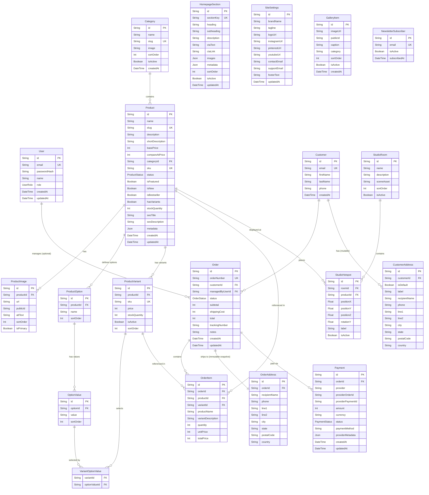

# THE INFAMOUS CHITRAKAR — Architecture Plan

## A. Folder Structure

```
infamous-chitrakar/
├── prisma/
│   ├── schema.prisma
│   ├── seed.ts
│   └── migrations/
├── public/
│   ├── fonts/
│   │   ├── Kabel/
│   │   └── GlacialIndifference/
│   ├── textures/
│   │   ├── paper-cream.webp
│   │   ├── paper-torn-edge.webp
│   │   ├── grain-overlay.webp
│   │   ├── tape.webp
│   │   └── ink-splatter.webp
│   ├── icons/
│   │   └── brand-cat.svg
│   └── images/
│       ├── hero/
│       ├── studio/
│       ├── products/
│       ├── gallery/
│       ├── sketchbook/
│       └── cards/
├── src/
│   ├── app/
│   │   ├── layout.tsx                    # Root layout (fonts, Lenis, providers)
│   │   ├── globals.css                   # Global styles + design tokens
│   │   ├── (store)/                      # Customer-facing route group
│   │   │   ├── layout.tsx                # Store layout (nav, footer, cart drawer)
│   │   │   ├── page.tsx                  # Homepage
│   │   │   ├── shop/
│   │   │   │   ├── page.tsx              # Shop listing
│   │   │   │   └── [category]/
│   │   │   │       └── page.tsx          # Category-filtered shop
│   │   │   ├── product/
│   │   │   │   └── [slug]/
│   │   │   │       └── page.tsx          # Product detail page
│   │   │   ├── cart/
│   │   │   │   └── page.tsx              # Full cart page (mobile)
│   │   │   ├── checkout/
│   │   │   │   ├── page.tsx              # Checkout flow
│   │   │   │   └── success/
│   │   │   │       └── page.tsx          # Order confirmation
│   │   │   ├── studio/
│   │   │   │   └── page.tsx              # Full 3D studio experience
│   │   │   └── story/
│   │   │       └── page.tsx              # Brand story
│   │   ├── admin/
│   │   │   ├── layout.tsx                # Admin layout (sidebar, auth guard)
│   │   │   ├── login/
│   │   │   │   └── page.tsx
│   │   │   ├── dashboard/
│   │   │   │   └── page.tsx
│   │   │   ├── products/
│   │   │   │   ├── page.tsx              # Product list
│   │   │   │   ├── new/
│   │   │   │   │   └── page.tsx          # Create product
│   │   │   │   └── [id]/
│   │   │   │       └── page.tsx          # Edit product
│   │   │   ├── categories/
│   │   │   │   └── page.tsx
│   │   │   ├── orders/
│   │   │   │   ├── page.tsx              # Order list
│   │   │   │   └── [id]/
│   │   │   │       └── page.tsx          # Order detail
│   │   │   ├── homepage/
│   │   │   │   └── page.tsx              # Homepage content editor
│   │   │   ├── studio/
│   │   │   │   └── page.tsx              # Studio rooms/hotspots editor
│   │   │   └── gallery/
│   │   │       └── page.tsx              # Gallery manager
│   │   └── api/
│   │       ├── payments/
│   │       │   ├── create-order/
│   │       │   │   └── route.ts
│   │       │   └── verify/
│   │       │       └── route.ts
│   │       ├── webhooks/
│   │       │   └── razorpay/
│   │       │       └── route.ts
│   │       ├── newsletter/
│   │       │   └── route.ts
│   │       └── upload/
│   │           └── route.ts          # Returns Cloudinary signed params (not a file proxy)
│   ├── components/
│   │   ├── ui/                           # Reusable primitives
│   │   │   ├── Button.tsx
│   │   │   ├── Input.tsx
│   │   │   ├── Badge.tsx
│   │   │   ├── Modal.tsx
│   │   │   ├── Select.tsx
│   │   │   ├── Toast.tsx
│   │   │   ├── Skeleton.tsx
│   │   │   ├── TornEdge.tsx
│   │   │   ├── TapeLabel.tsx
│   │   │   ├── PaperTexture.tsx
│   │   │   ├── HandwrittenNote.tsx
│   │   │   ├── Polaroid.tsx
│   │   │   └── FilmStrip.tsx
│   │   ├── layout/
│   │   │   ├── Navbar.tsx
│   │   │   ├── MobileMenu.tsx
│   │   │   ├── CartDrawer.tsx
│   │   │   └── Footer.tsx
│   │   ├── hero/
│   │   │   ├── HeroSection.tsx
│   │   │   ├── HeroTypography.tsx
│   │   │   ├── CategoryStrip.tsx
│   │   │   └── HeroDoodles.tsx
│   │   ├── studio/
│   │   │   ├── StudioSection.tsx
│   │   │   ├── StudioScene.tsx           # R3F Canvas
│   │   │   ├── StudioRoom.tsx
│   │   │   ├── StudioHotspot.tsx
│   │   │   ├── RoomNavigation.tsx
│   │   │   └── StudioFallback.tsx        # 2D fallback / loading
│   │   ├── exhibition/
│   │   │   ├── ExhibitionSection.tsx
│   │   │   └── ProductCard.tsx
│   │   ├── posters/
│   │   │   ├── PostersSection.tsx
│   │   │   └── SketchbookViewer.tsx
│   │   ├── playing-cards/
│   │   │   ├── PickACardSection.tsx
│   │   │   └── CardDeck.tsx
│   │   ├── signature/
│   │   │   └── SignatureSection.tsx
│   │   ├── gallery/
│   │   │   └── FromTheStudio.tsx
│   │   ├── newsletter/
│   │   │   └── NewsletterSection.tsx
│   │   ├── footer/
│   │   │   └── SiteFooter.tsx
│   │   ├── cart/
│   │   │   ├── CartItem.tsx
│   │   │   ├── CartSummary.tsx
│   │   │   └── QuantitySelector.tsx
│   │   ├── products/
│   │   │   ├── ProductGallery.tsx
│   │   │   ├── ProductInfo.tsx
│   │   │   ├── VariantSelector.tsx
│   │   │   ├── RelatedProducts.tsx
│   │   │   └── ShopProductCard.tsx
│   │   └── admin/
│   │       ├── AdminSidebar.tsx
│   │       ├── StatsCard.tsx
│   │       ├── ProductForm.tsx
│   │       ├── CategoryForm.tsx
│   │       ├── OrderTable.tsx
│   │       ├── HomepageEditor.tsx
│   │       ├── ImageUploader.tsx
│   │       └── DataTable.tsx
│   ├── features/
│   │   ├── cart/
│   │   │   ├── cart-store.ts             # Zustand cart state
│   │   │   ├── cart-utils.ts
│   │   │   └── cart-types.ts
│   │   ├── products/
│   │   │   └── product-utils.ts
│   │   └── checkout/
│   │       └── checkout-utils.ts
│   ├── lib/
│   │   ├── db.ts                         # Prisma client singleton
│   │   ├── auth.ts                       # Auth.js config
│   │   ├── cloudinary.ts                 # Cloudinary config + helpers
│   │   ├── razorpay.ts                   # Razorpay server-side client
│   │   ├── email.ts                      # Resend config
│   │   ├── validations/
│   │   │   ├── product.ts
│   │   │   ├── order.ts
│   │   │   ├── cart.ts
│   │   │   ├── auth.ts
│   │   │   └── homepage.ts
│   │   └── utils.ts                      # cn(), formatPrice(), etc.
│   ├── server/
│   │   ├── actions/
│   │   │   ├── product-actions.ts
│   │   │   ├── category-actions.ts
│   │   │   ├── order-actions.ts
│   │   │   ├── homepage-actions.ts
│   │   │   ├── studio-actions.ts
│   │   │   ├── gallery-actions.ts
│   │   │   ├── settings-actions.ts
│   │   │   └── newsletter-actions.ts
│   │   └── queries/
│   │       ├── product-queries.ts
│   │       ├── category-queries.ts
│   │       ├── order-queries.ts
│   │       ├── homepage-queries.ts
│   │       ├── studio-queries.ts
│   │       ├── settings-queries.ts
│   │       └── gallery-queries.ts
│   ├── hooks/
│   │   ├── useGSAP.ts
│   │   ├── useLenis.ts
│   │   ├── useMediaQuery.ts
│   │   ├── useReducedMotion.ts
│   │   └── useIntersection.ts
│   ├── types/
│   │   ├── index.ts
│   │   ├── product.ts
│   │   ├── order.ts
│   │   └── homepage.ts
│   └── config/
│       ├── site.ts                       # Site metadata, nav links
│       └── categories.ts                 # Category definitions
├── .env.example
├── .env.local
├── .gitignore
├── next.config.ts
├── tailwind.config.ts
├── tsconfig.json
├── package.json
└── README.md
```

---

## B. Database Schema — Entities & Relationships



### Variant System — How It Works

**Simple product** (e.g. Sticker Pack): `hasVariants = false`, uses `Product.basePrice` and `Product.stockQuantity` directly. No options or variants needed.

**Product with variants** (e.g. T-Shirt): `hasVariants = true`
```
Product: "Raised Right Tee" (basePrice = 129900)
├── ProductOption: "Size" (sortOrder: 0)
│   └── OptionValues: S, M, L, XL
├── ProductOption: "Color" (sortOrder: 1)
│   └── OptionValues: Black, White
└── ProductVariants:
    ├── Variant: SKU=RRT-S-BLK, price=129900, stock=10
    │   └── VariantOptionValues: [Size→S, Color→Black]
    ├── Variant: SKU=RRT-M-BLK, price=129900, stock=15
    │   └── VariantOptionValues: [Size→M, Color→Black]
    ├── Variant: SKU=RRT-L-WHT, price=139900, stock=8
    │   └── VariantOptionValues: [Size→L, Color→White]
    └── ... (each purchasable combination)
```

Each `ProductVariant` has its own SKU, price, and stock. The join table `VariantOptionValue` links a variant to specific option values. This is lightweight but handles real combinations.

### Address Architecture

- **`CustomerAddress`** — mutable, belongs to Customer, used to pre-fill checkout forms
- **`OrderAddress`** — immutable snapshot, created at order time, never changes even if customer updates their address later

### Payment Architecture

Razorpay fields are stored in the `Payment` entity, not on `Order`. This allows:
- Multiple payment attempts per order (e.g., failed → retry)
- Provider-agnostic design (switch/add providers later)
- Clean separation of order state vs payment state

> [!NOTE]
> All prices are stored in **paise** (₹1 = 100 paise) as integers — never floats.
> Enums: `UserRole` (ADMIN, SUPER_ADMIN), `ProductStatus` (DRAFT, ACTIVE, ARCHIVED), `OrderStatus` (PENDING, PAID, PROCESSING, SHIPPED, DELIVERED, CANCELLED, REFUNDED), `PaymentStatus` (PENDING, AUTHORIZED, PAID, FAILED, REFUNDED).

---

## C. Route Structure

### Customer Routes

| Route | Purpose |
|---|---|
| `/` | Homepage (all 9 sections) |
| `/shop` | Shop listing with filters |
| `/shop/[category]` | Category-filtered shop |
| `/product/[slug]` | Product detail page |
| `/cart` | Full cart page (mobile) |
| `/checkout` | Checkout flow |
| `/checkout/success` | Order confirmation |
| `/studio` | Full-screen 3D studio |
| `/story` | Brand story page |

### Admin Routes

| Route | Purpose |
|---|---|
| `/admin/login` | Admin login |
| `/admin/dashboard` | Revenue, orders, stock overview |
| `/admin/products` | Product list |
| `/admin/products/new` | Create product |
| `/admin/products/[id]` | Edit product |
| `/admin/categories` | Category management |
| `/admin/orders` | Order list |
| `/admin/orders/[id]` | Order detail |
| `/admin/homepage` | Homepage content editor |
| `/admin/studio` | Studio rooms/hotspots |
| `/admin/gallery` | Gallery manager |

### API Routes

| Route | Method | Purpose |
|---|---|---|
| `/api/payments/create-order` | POST | Create Razorpay order |
| `/api/payments/verify` | POST | Verify payment signature |
| `/api/webhooks/razorpay` | POST | Razorpay webhook handler |
| `/api/newsletter` | POST | Newsletter subscription |
| `/api/upload/sign` | POST | Generate Cloudinary signed upload params |

---

## D. Admin Capabilities

### Dashboard
- Total revenue (today, week, month)
- Order count by status
- Pending orders alert
- Low stock products alert
- Recent 10 orders

### Products
- CRUD with image upload (direct-to-Cloudinary signed upload)
- Option management (define Size, Color, Frame etc. per product)
- Variant management (create purchasable combinations with SKU, price, stock)
- Status toggle (Draft → Active → Archived)
- Featured / New / Bestseller flags
- Stock management (per-variant or per-product for simple products)
- SEO fields

### Categories
- CRUD, reorder, activate/deactivate
- Category image

### Orders
- View with filters (status, date range)
- Update fulfillment status
- Add tracking number
- View customer + shipping address snapshot + items + payment details

### Homepage Content
- Section-by-section editor for headings, descriptions, CTAs, images
- Featured product selection for Exhibition section
- **NOT** a page builder — structured fields only

### Studio
- Create/edit/reorder/activate/deactivate rooms
- Assign products to hotspots within rooms
- Set hotspot positions (x, y, z) and rotation
- Enable/disable individual hotspots
- All changes take effect without modifying scene code

### Gallery
- Upload/delete/reorder gallery images (direct-to-Cloudinary)
- Caption editing

### Site Settings
- Brand name, tagline, logo
- Social links (Instagram, Pinterest, YouTube)
- Contact/support email
- Footer text

> [!IMPORTANT]
> **ADMIN CONTROLS CONTENT. DEVELOPER CONTROLS DESIGN.**
>
> Admin must **NOT** control: fonts, spacing, colors, animations, GSAP timelines, layout, breakpoints, or component structure.
> Admin only controls business data and content that the client might realistically change without a developer.

---

## E. Component Architecture

### Design System Components (Artistic UI Kit)
These capture the brand's visual language as reusable primitives:

- `TornEdge` — SVG-masked torn paper border (top, bottom, or both)
- `PaperTexture` — Cream paper background with optional grain overlay
- `TapeLabel` — Scotch tape + label combination
- `HandwrittenNote` — Angled text with handwriting font
- `Polaroid` — Photo in polaroid frame with caption + slight rotation
- `FilmStrip` — Filmstrip decoration element
- `Badge` — "NEW", "LIMITED RUN" labels in brand style

### Layout Components
- `Navbar` — Fixed, semi-transparent with brand logo, nav links, search, bag counter
- `Footer` — Full brand footer with cat illustration
- `CartDrawer` — Slide-out panel (desktop), full-screen (mobile)

### Section Components (Homepage)
Each section is a self-contained component receiving data via server queries:
1. `HeroSection` → `HeroTypography` + `CategoryStrip` + `HeroDoodles`
2. `StudioSection` → `StudioScene` (R3F) + `RoomNavigation`
3. `ExhibitionSection` → Editorial `ProductCard` array
4. `PostersSection` → `SketchbookViewer` with page flip
5. `PickACardSection` → `CardDeck` with cursor interaction
6. `SignatureSection` → Polaroid-style portfolio layout
7. `FromTheStudio` → Gallery grid with Instagram link
8. `NewsletterSection` → Cinematic background + email input
9. `SiteFooter` → Brand footer with cat

---

## F. Animation Architecture

```
Animation Layer
├── Lenis (smooth scroll engine)
│   └── Initialized in root layout, wraps entire app
├── GSAP + ScrollTrigger
│   ├── Hero entrance timeline
│   ├── Section reveal triggers (per-section)
│   ├── Typography kinetic animations
│   ├── Image parallax layers
│   ├── Torn paper sliding transitions
│   ├── Product card float/reveal
│   ├── Playing card cursor reactions
│   ├── Horizontal gallery scroll (pinned)
│   └── Newsletter section zoom
├── Framer Motion (selective)
│   ├── Cart drawer open/close
│   ├── Modal transitions
│   ├── Page transitions (route changes)
│   └── Micro-interactions (buttons, badges)
└── CSS Animations
    ├── Cursor hover states
    ├── Skeleton loading pulses
    └── Simple opacity fades
```

### Rules
- Only animate `transform`, `opacity`, `clip-path` — never `width`/`height`/`top`/`left`
- Respect `prefers-reduced-motion` — disable GSAP timelines, simplify to opacity fades
- Mobile: reduce parallax depth, disable heavy ScrollTrigger pins
- Lazy-register ScrollTrigger per section via Intersection Observer

---

## G. 3D Studio Architecture

```
StudioScene (R3F Canvas)
├── SceneManager
│   ├── CameraController (OrbitControls, constrained)
│   ├── LightingRig (ambient + directional + point lights)
│   └── RoomManager
│       ├── Room (GLTF scene or procedural geometry)
│       │   ├── Walls (textured planes)
│       │   ├── Floor (textured plane)
│       │   ├── Props (furniture, easels, plants)
│       │   └── ProductHotspots[]
│       │       ├── HotspotMarker (billboard sprite, pulsing)
│       │       ├── ProductPreview (on hover — floating card)
│       │       └── onClick → open product modal
│       └── RoomTransition (camera lerp between rooms)
├── PostProcessing (optional)
│   └── Subtle vignette, warm color grade
└── LoadingScreen
    └── Progress bar with brand style
```

### Data Flow
```
Admin → DB (room config, hotspot positions, product assignments)
         ↓
Server Query → StudioSection component
         ↓
Props → R3F Scene (rooms[], hotspots[])
         ↓
User interaction → Product modal (client-side)
```

### Early Prototype (before full Phase 8)
Before building the complete studio, create a small R3F proof-of-concept proving:
1. 3D room with textured walls/floor
2. A product hotspot marker in the scene
3. Hover → product label appears
4. Click → opens product detail modal
5. Camera orbit controls

This validates the pipeline: **DB hotspot data → R3F scene → user interaction → product details**.

### Full Implementation (Phase 8)
Since real GLTF assets aren't available initially, build:
1. Procedural rooms with textured planes (walls, floor, ceiling)
2. Placeholder frames/objects as simple geometry
3. Data-driven hotspot markers at admin-configurable positions
4. Camera orbit with room-switching transitions
5. Architecture ready to swap in real GLB models later
6. Admin can create rooms, assign products, set positions — no code changes needed

---

## H. Development Phases

### Phase 1 — Foundation ✦ *current*
- [x] Next.js project scaffolding
- [ ] Tailwind config with brand tokens
- [ ] Custom fonts (Kabel, Glacial Indifference)
- [ ] Global CSS (textures, grain, torn edges)
- [ ] Prisma schema + PostgreSQL setup
- [ ] Auth.js configuration
- [ ] Environment variables
- [ ] Core utilities (`cn`, `formatPrice`, etc.)

### Phase 2 — Design System + Layout
- [ ] Artistic UI components (TornEdge, PaperTexture, Polaroid, etc.)
- [ ] Navbar
- [ ] Footer
- [ ] Lenis smooth scroll
- [ ] Cart drawer shell

### Phase 3 — Homepage Sections (Part 1)
- [ ] Hero section (typography, doodles, category strip)
- [ ] Studio section (2D placeholder + architecture)
- [ ] **R3F prototype** (room → hotspot → click → product detail — proof of concept)
- [ ] Exhibition section (editorial product cards)
- [ ] GSAP scroll animations for sections 1–3

### Phase 4 — Homepage Sections (Part 2)
- [ ] Posters & Frames + Sketchbook
- [ ] Pick a Card (cursor-reactive deck)
- [ ] Signature Collection
- [ ] From The Studio (gallery)
- [ ] Newsletter
- [ ] GSAP scroll animations for sections 4–8

### Phase 5 — Product System
- [ ] Product detail page (editorial layout)
- [ ] Shop page (filters, search, pagination)
- [ ] Image gallery with zoom/lightbox
- [ ] Variant selection
- [ ] Related products
- [ ] SEO metadata

### Phase 6 — Cart & Checkout
- [ ] Zustand cart store
- [ ] Cart drawer (full implementation)
- [ ] Cart page (mobile)
- [ ] Checkout page
- [ ] Razorpay integration
- [ ] Order creation flow
- [ ] Payment verification
- [ ] Success page

### Phase 7 — Admin Dashboard
- [ ] Admin authentication
- [ ] Dashboard overview
- [ ] Product CRUD
- [ ] Category management
- [ ] Order management
- [ ] Homepage content editor
- [ ] Gallery manager
- [ ] Image upload (Cloudinary)

### Phase 8 — 3D Studio (full implementation)
- [ ] Full R3F scene (expanding on Phase 3 prototype)
- [ ] Multi-room procedural geometry
- [ ] Constrained camera controls (orbit + pan limits)
- [ ] Room switching with camera transitions
- [ ] Data-driven product hotspots (admin-managed)
- [ ] Hover previews + click → product detail
- [ ] Touch controls (mobile)
- [ ] Admin studio editor (rooms, hotspots, product assignments)
- [ ] Lazy loading (don't load 3D until section is near viewport)

### Phase 9 — Polish & Launch Prep
- [ ] Full animation pass
- [ ] Performance optimization
- [ ] Lighthouse audit
- [ ] Responsive testing
- [ ] SEO (sitemap, structured data, robots.txt)
- [ ] Error handling
- [ ] Loading states
- [ ] 404 page
- [ ] Security audit
- [ ] Seed data

> [!IMPORTANT]
> Each phase ends with: build check, TypeScript check, lint pass, visual review.
> Phases are designed so the site is **demonstrable** after Phase 4.
